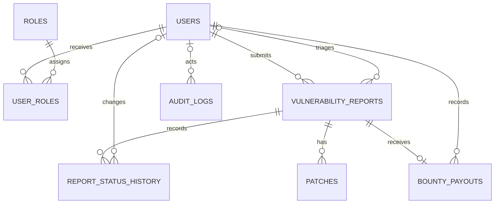

# ER diagram

```mermaid
erDiagram
  USERS ||--o{ USER_ROLES : receives
  ROLES ||--o{ USER_ROLES : assigns
  USERS ||--o{ VULNERABILITY_REPORTS : submits
  USERS o|--o{ VULNERABILITY_REPORTS : triages
  VULNERABILITY_REPORTS ||--o{ REPORT_STATUS_HISTORY : records
  USERS o|--o{ REPORT_STATUS_HISTORY : changes
  VULNERABILITY_REPORTS ||--o{ PATCHES : has
  VULNERABILITY_REPORTS ||--o| BOUNTY_PAYOUTS : receives
  USERS ||--o{ BOUNTY_PAYOUTS : records
  USERS o|--o{ AUDIT_LOGS : acts
```

MongoDB's `report_evidence` collection is intentionally not shown as a relational entity. It references the PostgreSQL report UUID but has no cross-database foreign key.
